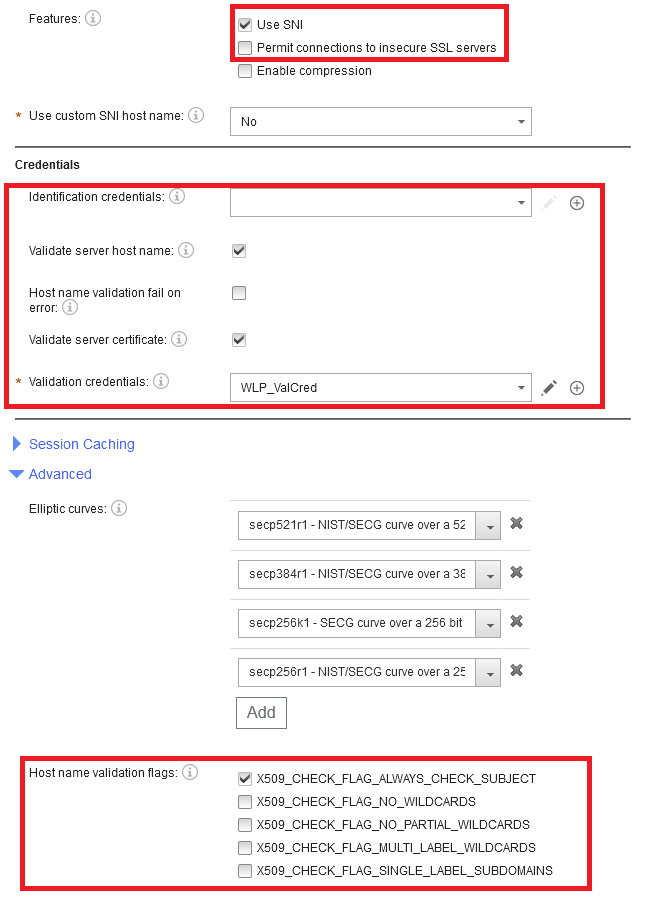

# DataPower TLS Configuration for certificates validation with a SSL Client Profile

This small article is a go at explaining some of the possible configurations and the benefits of each configuration. The goal is to demonstrate the behavior of the various configurations.

In fact, we are concentrating on the following parameters of a SSL Client Profile in the red boxes below:



This article is not intended to explain TLS, so requires a good understanding of the SSL/TLS protocol, I have another deep article on the subject [here](https://github.com/ADesprets/TLS/blob/master/README.md)

# Table of Content

1. [Introduction](#introduction)
1. [Environment](#environment)
1. [Explanations](#explanations)
1. [Tests](#tests)
1. [Conclusion](#conclusion)

# Introduction

# Environment
## Software
The environment is as follow:
* A workstation running Windows 10
* WebSphere Liberty application server (WebSphere Application Server 19.0.0.5/wlp-1.0.28.cl190520190522-2227) on Java HotSpot(TM) 64-Bit Server VM, version 1.8.0_212-b10 (en_US)
* Within this application server runs a JAX-RX application secured with HTTPS, the key store and trust store is going to be changed during the various tests.
* DataPower Virtual with firmware	IDG.2018.4.1.9
* Within a test domain, a multiprotocol gateway (mpgw) with a processing policy that does nothing (two rules with equal statement and a return action really used for Probing in case of)
* This mpgw is using a SSL Client profile that will be the subject of our attention in this article.

I also use two additional software
* openssl to generate the chain of certificates
* KeyStore Explorer to display the contents of the P12
* curl to send HTTP(S) request

Below a diagram showing the overall environment


## Certificates

### Server certificates

First, we look at the structure of the certificates used on the application server.
All the certificates are chained certificates and not self-signed, because this what exist in real life. We have the server certificate signed by an intermediary signed by a root (self-signed).
Since we are going to play with a the SAN - Subject Alternate Names and the Common name, I have four set of certificates. The intermediary and the root are the same for the four sets. In the various tests, we will replace the key store of the application server in order to expose the various certificates.

1. **Chain cnok-sanok**
  - CN is equal to the back end server hostname (fully qualified)
  - SAN contains the hostname of back end server (fully qualified)
2. **Chain cnko-sanok**
  - CN is different from back end server hostname
  - SAN contains the hostname of back end server
3. **Chain cnok-sanko**
  - CN is equal to the back end server hostname
  - SAN does not contain the hostname of back end server
4. **Chain cnko-sanko**
  - CN is different from back end server hostname
  - SAN does not contain the hostname of back end server


  |                                  | CN with hostname | CN is different from hostname |
  |----------------------------------|------------------|-------------------------------|
  | **SAN contains hostame**         |    cnok-sanok    |           cnko-sanok          |
  | **SAN does not contain hostame** |    cnok-sanko    |           cnko-sanko          |


The diagram below resumes the configuration of the certificates.


### SSL Client profile configuration

As discussed previously, we are going to use the following properties of the SSL Client profile. In fact, we are not going to use all of  them... Permit connections to insecure SSL servers, and enable compression because they raises security concerns. Identifications credentials because we are not addressing mutual TLS in this article since we concentrate on the server side validation of the host. We will not use all the flags addressing wildcards because using wildcards is just a simplification to support many certificates at the same time.

The *SSL Client Profile* Objects are as follow:


The parameters of an SSL Client Profile we are interested in this article:
- Features
	- *Use SNI*: Indicate whether to send the Server Name Indication (SNI) TLS extension in the client hello message.
	- *Permit connections to insecure SSL servers*: Indicate whether to permit connections to SSL servers that do not support RFC 5746 during the SSL handshake. Such servers are vulnerable to man-in-the-middle attacks as documented in CVE-2009-3555. The default setting is off.
	- *Enable compression*: Indicate whether to enable SSL compression. Enabling SSL compression in HTTPS is dangerous because the connection becomes vulnerable to the CRIME attack.
- Credentials
	- *Identification credentials*: Specify an optional identification credentials that the appliance uses to identify itself to an SSL server if client authentication is requested.
	- *Validate server host name*: Set whether to validate the host name in the server certificate during the handshake.
	- *Host name validation fail on error*: Set whether to terminate the handshake when host name validation fails or to ignore the failure, log an event, and continue with server certificate validation. The default behavior is to ignore the failure, log an event, and continue with any configured server certificate validation.
	- *Validate server certificate*: Indicate whether to validate the server certificate during the SSL handshake.
	- *Validation credentials*: Specify an optional set of validation credentials to authenticate the certificate that the SSL server sends during the SSL handshake.
- Advanced
	- *Host name validation flags*: Set the flags that fine tune the validation methods and settings during the handshake. The default behavior uses the subject DN only when the Subject Alternative Name (SAN) extension contains no DNS names.
		- *X509_CHECK_FLAG_ALWAYS_CHECK_SUBJECT*: When set, use the subject DN for host name comparison when the Subject Alternative Name (SAN) extension contains one or more DNS names and no match is found.
		- *X509_CHECK_FLAG_NO_WILDCARDS*: When set, wildcards are not expanded.
		- *X509_CHECK_FLAG_NO_PARTIAL_WILDCARDS*: When set, prevents the expansion of wildcards when used as a prefix ( \*ibm) or a suffix ( ibm\*).
		- *X509_CHECK_FLAG_MULTI_LABEL_WILDCARDS*: When set, allows the expansion of wildcards to more than one label. For example, when *.ibm.com allows expansion to www.ibm.com or www.dp.ibm.com.
		- *X509_CHECK_FLAG_SINGLE_LABEL_SUBDOMAINS*: When set, limits matches to direct child subdomains. For example, when .ibm.com matches www.ibm.com or dp.ibm.com but not www.dp.ibm.com.


# Explanations
If the option *Validate server host name* is checked then when validating the certificate hostname, DataPower first checks the entries in the SAN.
If there is no entry in the SAN, then if *X509_CHECK_FLAG_ALWAYS_CHECK_SUBJECT* the CN of the DN of the server certificate is checked. If the flag is disable it will fail.
If the case there is a failure then if the *Host name validation fail on error* is checked then the processing stops and returns an error. If it is valid, notice that in this case there is no validation against the Validation Credential. This is important to know, and in fact there is a message logged with a level warn. The message is *Server certificate validation cannot be performed when host name validation fail on error is enabled*.
You can see that this *Host name validation fail on error* is really to avoid the validation of the certificate against the trust store and provides a dynamic way to validate a certificate. Having said that, this is a light way, and I would not recommend to use it in most cases (except if you have sufficient trust on the backends and that they may change frequently) .

# Tests
For each test, before performing the various test I use the openssl command to validate that the certificate are correctly setup in the application server.
The command is:
`openssl.exe s_client -showcerts -connect <application server host name>:<port> | grep -e s: -e i:`
in my case
`openssl.exe s_client -showcerts -connect tdesprets.fr.ibm:9449 | grep -e s: -e i:`
which gives:
```
0 s:/C=FR/ST=Herault/L=Montpellier/O=Dummy org/OU=DataPower dept/CN=laptop-g5om000i
  i:/C=FR/ST=Herault/L=Montpellier/O=Dummy int/OU=DataPower dept/CN=Intermediary/emailAddress=admin@fr.ibm.com
1 s:/C=FR/ST=Herault/L=Montpellier/O=Dummy int/OU=DataPower dept/CN=Intermediary/emailAddress=admin@fr.ibm.com
  i:/C=FR/ST=Herault/L=Montpellier/O=Dummy root org/OU=DataPower dept/CN=Root_CA/emailAddress=admon@fr.ibm.com
2 s:/C=FR/ST=Herault/L=Montpellier/O=Dummy root org/OU=DataPower dept/CN=Root_CA/emailAddress=admon@fr.ibm.com
  i:/C=FR/ST=Herault/L=Montpellier/O=Dummy root org/OU=DataPower dept/CN=Root_CA/emailAddress=admon@fr.ibm.com
```

To test the service, I use curl to invoke the multi protocol gateway in DataPower. Of course, you have to adapt to your backend of and server configuration.

- Direct access to the application server:
```
curl -k -H "Accept: application/json" "https://tdesprets.fr.ibm:9449/loanmgt/resources/loans/v1/quote?loanAmount=10000&annualInterestRate=1.1&termInMonths=36"
{"loanAmount":10000,"annualInterestRate":1.1,"termInMonths":36,"monthlyPaymentAmount":282.51360281363674}
```
- Through DataPower:
```
curl -k -H "Accept: application/json" "http://dpdpod.fr.ibm:8449/loanmgt/resources/loans/v1/quote?loanAmount=10000&annualInterestRate=1.1&termInMonths=36"
{"loanAmount":10000,"annualInterestRate":1.1,"termInMonths":36,"monthlyPaymentAmount":282.51360281363674}
```

## Test 1
### Objectives
In this test we only have the CN valid. So we use the chain cnok-sanko. We want to check how the SAN is used. Is it a valid scenario and the impact of the *Validate server certificate* option.
Configuration: back end with chain of certificates **cnok-sanko**

### Runs
#### Run 1
Validate server host name => checked
Host name validation fail on error => checked
Validate server certificate => checked
Crypto Validation Credential contains the Root_CA/Intermediary
All flags unchecked

Result: <span style="color:red">error</span>

#### Run 2
Validate server host name => checked
Host name validation fail on error => checked
Validate server certificate => checked
Crypto Validation Credential contains the Root_CA/Intermediary
X509_CHECK_FLAG_ALWAYS_CHECK_SUBJECT => **checked**

Result: <span style="color:green">valid</span>

#### Run 3
Validate server host name => checked
Host name validation fail on error => checked
Validate server certificate => checked
Crypto Validation Credential **does not contains the Root_CA/Intermediary**
X509_CHECK_FLAG_ALWAYS_CHECK_SUBJECT => checked

Result: <span style="color:green">valid</span>

#### Run 4
Validate server host name => checked
Host name validation fail on error => **unchecked**
Validate server certificate => checked
Crypto Validation Credential does not contains the Root_CA/Intermediary
X509_CHECK_FLAG_ALWAYS_CHECK_SUBJECT => **unchecked**

Result: <span style="color:red">error</span>

#### Run 5
Validate server host name => checked
Host name validation fail on error => **unchecked**
Validate server certificate => checked
Crypto Validation Credential **contains the Root_CA/Intermediary**
X509_CHECK_FLAG_ALWAYS_CHECK_SUBJECT => **checked**

Result: <span style="color:green">valid</span>

#### Run 6
Validate server host name => checked
Host name validation fail on error => unchecked
Validate server certificate => checked
Crypto Validation Credential contains the Root_CA/Intermediary
X509_CHECK_FLAG_ALWAYS_CHECK_SUBJECT => **unchecked**

Result: <span style="color:green">valid</span>

#### Conclusion Test 1
This test concludes the precedence of the SAN, and if not valid entry in the SAN, then CN is checked if the flag *X509_CHECK_FLAG_ALWAYS_CHECK_SUBJECT* is checked. It also confirms that the *Crypto Validation Credential* is not used when the *Host name validation fail on error* is used.


## Test 2
### Objectives
In this test we only have the SAN valid. So we use the chain cnok-sanok. We want to validate that the SAN is used. We want to confirm the impact of the *Validate server certificate* option.
Configuration: back end with chain of certificates **cnko-sanok**

### Runs
#### Run 1
Validate server host name => checked
Host name validation fail on error => checked
Validate server certificate => checked
Crypto Validation Credential contains the Root_CA/Intermediary
All flags unchecked (or unchecked)

Result: <span style="color:green">valid</span>

#### Run 2
Validate server host name => checked
Host name validation fail on error => checked
Validate server certificate => checked
Crypto Validation Credential **does not contains the Root_CA/Intermediary**
All flags unchecked (or unchecked)

Result: <span style="color:green">valid</span>

#### Run 3
Validate server host name => checked
Host name validation fail on error => **unchecked**
Validate server certificate => checked
Crypto Validation Credential does not contains the Root_CA/Intermediary
All flags unchecked (or unchecked)

Result: <span style="color:red">error</span>

#### Run 4
Validate server host name => checked
Host name validation fail on error => unchecked
Validate server certificate => checked
Crypto Validation Credential **contains the Root_CA/Intermediary**
All flags unchecked (or unchecked)

Result: <span style="color:green">valid</span>

#### Conclusion Test 2
This test confirms that with SAN we do not need a special flags hence the precedence of the SAN. It also confirms the use of the *Host name validation fail on error* , if use then there is no use of the *Crypto Validation Credential*.

## Test 3
### Objectives
In this test both the CN and SAN are invalid. So we use the chain cnko-sanko. We want to check that with invalid certificate name it will fail. And check the use of the  *Validate server certificate* option.
Configuration: back end with chain of certificates **cnko-sanko**

### Runs
#### Run 1
Validate server host name => checked
Host name validation fail on error => checked
Validate server certificate => checked
Crypto Validation Credential contains the Root_CA/Intermediary
All flags unchecked

Result: <span style="color:red">error</span>

#### Run 2
Validate server host name => checked
Host name validation fail on error => **unchecked**
Validate server certificate => checked
Crypto Validation Credential contains the Root_CA/Intermediary
All flags unchecked

Result: <span style="color:green">valid</span> (Logs does not really have a message)

#### Run 3
Validate server host name => checked
Host name validation fail on error => unchecked
Validate server certificate => checked
Crypto Validation Credential **does not contain the Root_CA/Intermediary**
All flags unchecked

Result: <span style="color:red">error</span>

#### Conclusion Test 3
The behavior of the *Host name validation fail on error* is confirmed. The Crypto Validation Credential is used.

# Conclusion
The explanations have been confirmed. (This chapter to be completed)

# Appendix A - Certificate chain creation with openssl
This chapter is given as is and really is to provide an alternative approach to create certificates chains with openssl.
The goal is not to explain in depth the procedure but rather to use it to create your own chains.
What I will do is really to explain the process to use the scripts.
(This chapter to be completed)
